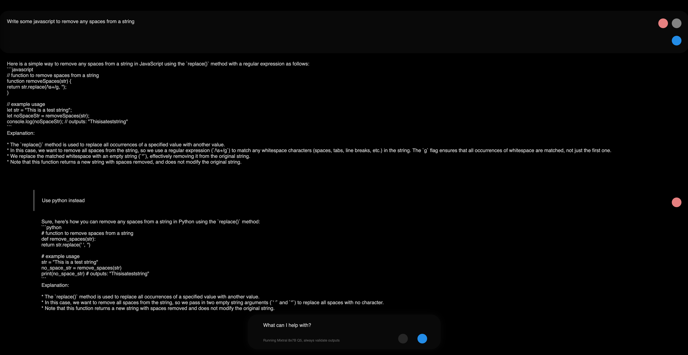
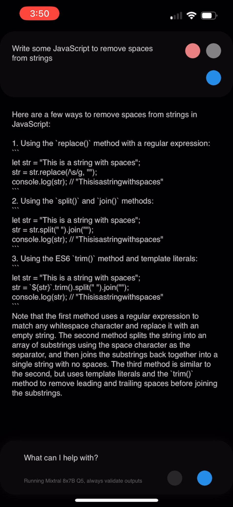
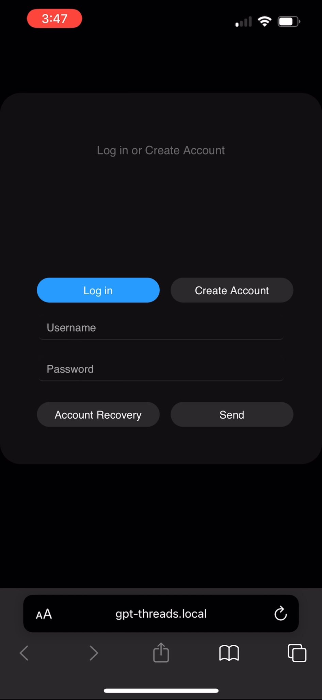
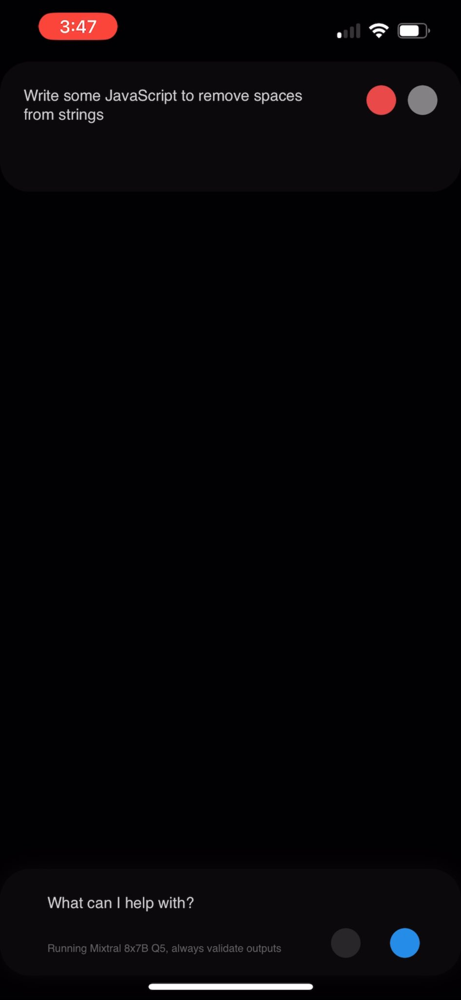
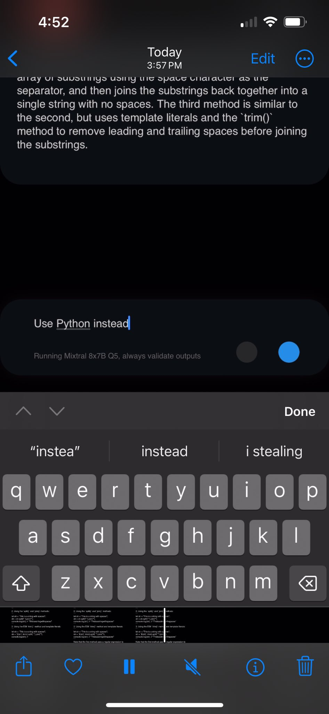

# gpt-threads

    

open-source AI app | running mixtral 8x7B / llama.cpp | single-layer threads interface | multi-user | private | offline capable

### Desktop

### Mobile PWA

## Install

1) Install Ubuntu Server 22.04 on any consumer pc with 64GB+ RAM

 - Direct Download:

       https://releases.ubuntu.com/23.10/ubuntu-23.10-live-server-amd64.iso
    
 - Torrent:

       https://releases.ubuntu.com/22.04/ubuntu-22.04.3-live-server-amd64.iso.torrent

2) During setup, choose "user" as the user / username, any hostname and any password, all other options default

3) Run the following commands:

        cd /home/user/
        git clone https://github.com/justinfilip/gpt-threads.git
        cd gpt-threads/gpt-threads-compute
        sudo bash init.sh

4) Enter your password and the automated server setup script will run

    - Depending on your CPU and internet bandwidth, setup time may vary from a few minutes to a few hours.

    - The machine will reboot when setup is complete.

5) Navigate to http://gpt-threads.local in your browser to access the application

6) Tap the share button on the webpage to "Add to Home Screen", this will install the PWA and make it available as an app icon on your iOS/Android device

    - To access the app from any network, install a VPN on the network the server is running on and connect your mobile devices to it. Use either a physical VPN device or in some cases, there is one available in the router for your home network. The server must be connected via ethernet to the network, making a physical VPN device / router a requirement.

## Hit share in mobile browser, install PWA

## More mobile screenshots

